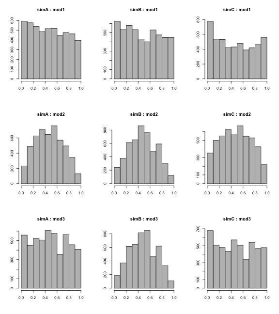

Our aim is to assess the validity of the three models for two-way tables that are discussed in [this report](http://rpubs.com/apbray/19154).  We do this by evaluating the conjecture that if we simulate data such as we might find in a two-way table, and if we apply one of these models to find the tail area associated with that observation, that the distribution of the resulting p-values will be approximately uniform.  The more specific conjecture is that this uniformity will hold when applied to the first model, but not the second.

### Context for the simulation
To figure out what the appropriate approach is to simulating this data, we consider a specific problem context such as that used in the textbook.

#### Scenario A
"The participants in this study were 48 male bank supervisors attending a management institute at the University of North Carolina in 1972. They were asked to assume the role of the personnel director of a bank and were given a personnel file to judge whether the person should be promoted to a branch manager position. The files given to the participants were identical, except that half of them indicated the candidate was male and the other half indicated the candidate was female. These files were randomly assigned to the subjects.

For each supervisor we recorded the gender associated with the assigned file and the promotion decision. Using the results of the study summarized in Table 2.1, we would like to evaluate if females are unfairly discriminated against in promotion decisions. In this study, a smaller proportion of females are promoted than males (0.583 versus 0.875), but it is unclear whether the difference provides convincing evidence that females are unfairly discriminated against."


It will be useful to consider two additional scenarios that differ only slightly from the scenario A.

#### Scenario B
Same as A but where the decisions are being made by a single entity, say the board of the bank, with the proviso that they can only promote a total of 12 candidates (assume that it is possible to put together otherwise identical files).

#### Scenario C
Same as A but where the 48 files were sampled randomly from a large population of files that had been paired up between genders for being otherwise identical.  In the population of files, there is an even gender split.

-----

### Code for the simulations

Each of the simulations below generates data according to the above scenarios with the assumption that promotion is independent of gender, or $P(promote|male) = P(promote|female) = P(promote)$.  We will set $P(promote) = 0.25$.


#### Scenario A

```r
simA <- function(n, pPromote) {
    gender <- rep(c("female", "male"), c(n/2, n/2))
    decision <- sample(c("promote", "no promote"), size = n, replace = TRUE, 
        prob = c(pPromote, 1 - pPromote))
    list(gender = gender, decision = decision)
}
```


#### Scenario B

```r
simB <- function(n) {
    gender <- rep(c("female", "male"), c(n/2, n/2))
    decision <- sample(rep(c("promote", "no promote"), c(0.25 * n, 0.75 * n)))
    list(gender = gender, decision = decision)
}
```


#### Scenario C

```r
simC <- function(n, pPromote) {
    gender <- sample(c("female", "male"), size = n, replace = TRUE, prob = c(0.5, 
        0.5))
    decision <- sample(c("promote", "no promote"), size = n, replace = TRUE, 
        prob = c(pPromote, 1 - pPromote))
    data.frame(gender = gender, decision = decision)
}
```


-----

### Code for the models

#### Model 1


```r
mod1 <- function(sim, it) {
    stat_obs <- table(sim$gender, sim$decision)[1, 2]
    stats_sim <- rep(NA, it)
    for (i in 1:it) {
        decision_shuffled <- sample(sim$decision)
        stats_sim[i] <- sum(decision_shuffled[1:(n/2)] == "promote")
    }
    mean(stats_sim < stat_obs)
}
```


#### Model 2

Note for Model 2 we use $\hat{P}(promote)$, the observed proportion in the simulated data.


```r
mod2 <- function(sim, it) {
    stat_obs <- table(sim$gender, sim$decision)[1, 2]
    pHatPromote <- sum(table(sim$gender, sim$decision)[, 2])/n
    stats_sim <- rep(NA, it)
    for (i in 1:it) {
        decision <- sample(c("promote", "no_promote"), size = n, replace = TRUE, 
            prob = c(pHatPromote, 1 - pHatPromote))
        stats_sim[i] <- sum(decision[1:(n/2)] == "promote")
    }
    mean(stats_sim < stat_obs)
}
```


#### Model 3

Note for Model 3 we use the true proportion $P(promote)$, the observed proportion in the simulated data.


```r
mod3 <- function(sim, it) {
    stat_obs <- table(sim$gender, sim$decision)[1, 2]
    stats_sim <- rep(NA, it)
    for (i in 1:it) {
        decision <- sample(c("promote", "no_promote"), size = n, replace = TRUE, 
            prob = c(pPromote, 1 - pPromote))
        stats_sim[i] <- sum(decision[1:(n/2)] == "promote")
    }
    mean(stats_sim < stat_obs)
}
```


----

### Simulation results





